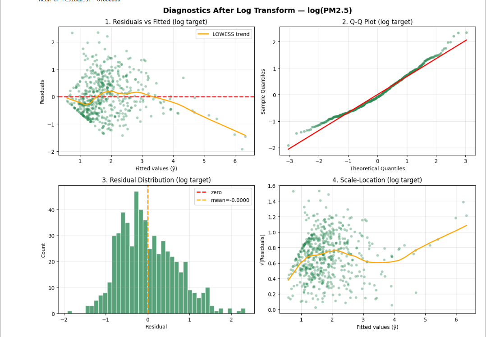

# 🌍 Global Weather & Air Pollution — Exploratory Data Analysis (Python)

## Overview
Conducted an Exploratory Data Analysis (EDA) on a global weather and air 
pollution dataset covering major cities worldwide (top 3 most populous cities 
per country), sourced from the OpenWeather API.

## Dataset
- **Source:** Kaggle / OpenWeather API & GeoNames
- **Coverage:** Top 3 most populous cities per country
- **Update frequency:** Daily
- **License:** CC BY 4.0

## Key Analysis Performed
- Temperature distribution and seasonal trends across continents
- Air Quality Index (AQI) analysis by city and country
- Correlation analysis between weather variables and pollution levels
- PM2.5 and PM10 concentration trends
- Wind speed, humidity, and pressure pattern analysis
- Daytime vs nighttime pollution comparison
- Weekend vs weekday weather and AQI trends
- Feature engineering: temp_category, comfort_proxy, wind_compass

## Tools Used
Python | Pandas | NumPy | Matplotlib | Seaborn | Jupyter Notebook

## Key Insights
- [Add your own findings here — e.g. "Cities in Asia showed highest AQI levels"]
- [e.g. "PM2.5 levels significantly higher in winter months"]
- [e.g. "Strong correlation found between humidity and AQI"]

## Data Source
- OpenWeather: https://openweathermap.org/
- GeoNames: https://www.geonames.org/
- ## Dashboard Preview

